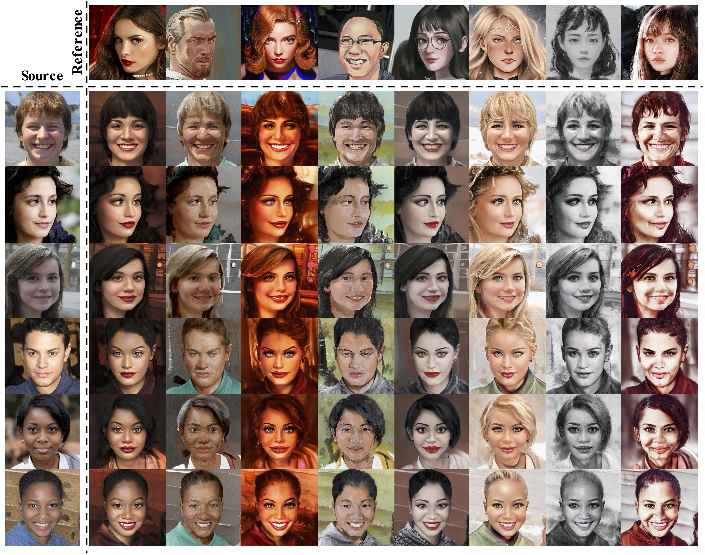

# BlendGAN: Implicitly GAN Blending for Arbitrary Stylized Face Generation <br><sub>Official PyTorch implementation of the NeurIPS 2021 paper</sub>



[Mingcong Liu](https://scholar.google.com/citations?user=IYx0IbgAAAAJ), [Qiang Li](https://scholar.google.com/citations?user=GGPvOP4AAAAJ), [Zekui Qin](https://github.com/ZekuiQin), [Guoxin Zhang](), [Pengfei Wan](), [Wen Zheng](https://sites.google.com/view/zhengwen-kwai)

Y-tech, Kuaishou Technology


### [Project page](https://onion-liu.github.io/BlendGAN) |   [Paper](https://arxiv.org/abs/2110.11728)

Abstract: *Generative Adversarial Networks (GANs) have made a dramatic leap in high-fidelity image synthesis and stylized face generation. Recently, a layer-swapping mechanism has been developed to improve the stylization performance. However, this method is incapable of fitting arbitrary styles in a single model and requires hundreds of style-consistent training images for each style. To address the above issues, we propose BlendGAN for arbitrary stylized face generation by leveraging a flexible blending strategy and a generic artistic dataset. Specifically, we first train a self-supervised style encoder on the generic artistic dataset to extract the representations of arbitrary styles. In addition, a weighted blending module (WBM) is proposed to blend face and style representations implicitly and control the arbitrary stylization effect. By doing so, BlendGAN can gracefully fit arbitrary styles in a unified model while avoiding case-by-case preparation of style-consistent training images. To this end, we also present a novel large-scale artistic face dataset AAHQ. Extensive experiments demonstrate that BlendGAN outperforms state-of-the-art methods in terms of visual quality and style diversity for both latent-guided and reference-guided stylized face synthesis.*

### Updates

:heavy_check_mark: (2021-12-03) The [AAHQ](https://github.com/onion-liu/aahq-dataset) dataset has been released!

:heavy_check_mark: (2021-11-22) add an interactive [demo](#Demo) based on Jupyter notebook

:heavy_check_mark: (2021-11-19) a web demo is integrated to [Huggingface Spaces](https://huggingface.co/spaces) with [Gradio](https://github.com/gradio-app/gradio). See demo: [](https://huggingface.co/spaces/akhaliq/BlendGAN)

:heavy_check_mark: (2021-11-19) Inference code and pretrained models have been released! 


## Pre-trained Models

You can download the following pretrained models to ./pretrained_models:

|  Model  | Discription  |
|  ----  | ----  |
| [blendgan](https://drive.google.com/file/d/1eF04jKMLAb9DvzI72m8Akn5ykWf3EafE/view?usp=sharing)  | BlendGAN model (together with style_encoder) |
| [psp_encoder](https://drive.google.com/file/d/14nevG94hNkkwaoK5eJLF1iv78cv5O8fN/view?usp=sharing) | PSP Encoder model |
| [style_encoder](https://drive.google.com/file/d/1EaM0ZYsAMdPkbRz0smLNIlJ1rxVAhbEz/view?usp=sharing) | Individual Style Encoder model (optional) |

## Inference

*Note: If you dislike the deformation in the generated images, `add_weight_index=7` may be a better choice.*

### 1. Generate image pairs with random face codes

- for latent-guided generation, run:

```bash
python generate_image_pairs.py --size 1024 --pics N_PICS --ckpt ./pretrained_models/blendgan.pt --outdir results/generated_pairs/latent_guided/
```

- for reference-guided generation, run:

```bash
python generate_image_pairs.py --size 1024 --pics N_PICS --ckpt ./pretrained_models/blendgan.pt --style_img ./test_imgs/style_imgs/100036.png --outdir results/generated_pairs/reference_guided/
```

### 2. Style tranfer with given face images

```bash
python style_transfer_folder.py --size 1024 --ckpt ./pretrained_models/blendgan.pt --psp_encoder_ckpt ./pretrained_models/psp_encoder.pt --style_img_path ./test_imgs/style_imgs/ --input_img_path ./test_imgs/face_imgs/ --outdir results/style_transfer/
```

### 3. Generate interpolation videos

```bash
python gen_video.py --size 1024 --ckpt ./pretrained_models/blendgan.pt --psp_encoder_ckpt ./pretrained_models/psp_encoder.pt --style_img_path ./test_imgs/style_imgs/ --input_img_path ./test_imgs/face_imgs/ --outdir results/inter_videos/
```

## Demo

```bash
jupyter notebook --notebook-dir=./
```


## Bibtex
If you use this code for your research, please cite our paper:
```
@inproceedings{liu2021blendgan,
    title = {BlendGAN: Implicitly GAN Blending for Arbitrary Stylized Face Generation},
    author = {Liu, Mingcong and Li, Qiang and Qin, Zekui and Zhang, Guoxin and Wan, Pengfei and Zheng, Wen},
    booktitle = {Advances in Neural Information Processing Systems},
    year = {2021}
}
```

## Credits
**StyleGAN2 model and implementation:**  
https://github.com/rosinality/stylegan2-pytorch  
Copyright (c) 2019 Kim Seonghyeon  
License (MIT) https://github.com/rosinality/stylegan2-pytorch/blob/master/LICENSE  

**IR-SE50 model and implementations:**  
https://github.com/TreB1eN/InsightFace_Pytorch  
Copyright (c) 2018 TreB1eN  
License (MIT) https://github.com/TreB1eN/InsightFace_Pytorch/blob/master/LICENSE

**pSp model and implementation:**   
https://github.com/eladrich/pixel2style2pixel  
Copyright (c) 2020 Elad Richardson, Yuval Alaluf  
License (MIT) https://github.com/eladrich/pixel2style2pixel/blob/master/LICENSE

**Please Note**:

- The CUDA files under the [StyleGAN2 ops directory](./op) are made available under the [Nvidia Source Code License-NC](https://nvlabs.github.io/stylegan2/license.html)
- The face images under the [test_imgs](./test_imgs/face_imgs) directory are selected from the [FFHQ](https://github.com/NVlabs/ffhq-dataset) dataset, which is made available under [Creative Commons BY-NC-SA 4.0](https://creativecommons.org/licenses/by-nc-sa/4.0/) license by NVIDIA Corporation.
- The artistic images under the [test_imgs](./test_imgs/style_imgs) directory are collected from [Artstation](https://www.artstation.com), and the copyright remains with the original owners.


## Acknowledgements

We sincerely thank all the reviewers for their comments. We also thank Zhenyu Guo for help in preparing the comparison to StarGANv2.
This code borrows heavily from the pytorch re-implementation of StyleGAN2 by [rosinality](https://github.com/rosinality/stylegan2-pytorch).

